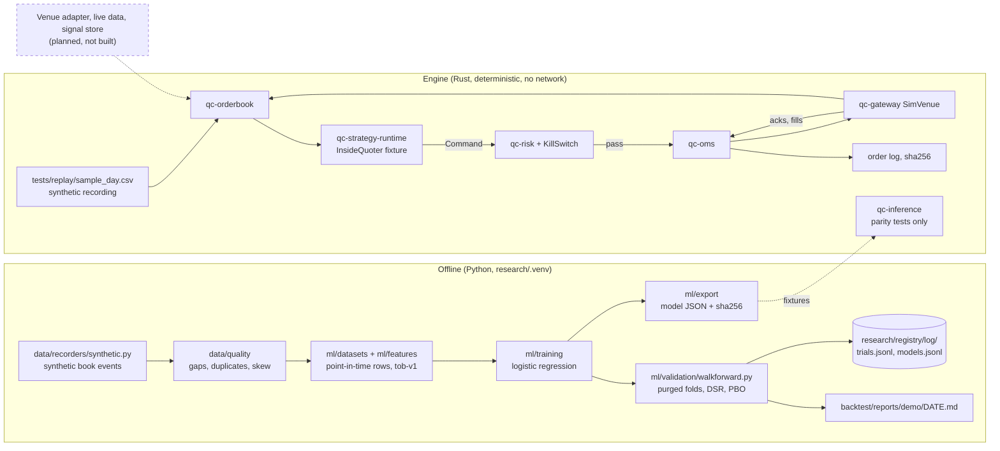
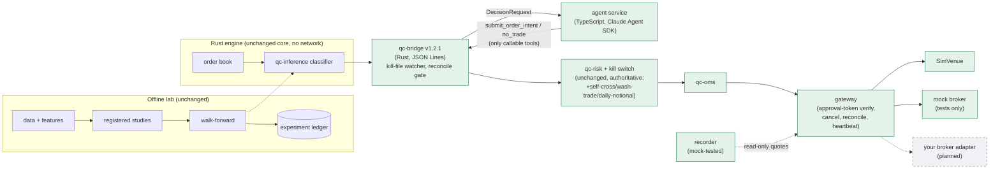

# Architecture

What is built, then what is planned.

quant-core has two halves that share files but never a process: an offline side (data, research,
ML, reports) and an execution side (the Rust engine). Today the execution side runs only against a
simulated venue on a synthetic recording, or (in `external` venue mode) a synthetic mock broker in tests — no code anywhere connects to a real venue or reads real credentials.
Per [ADR-0040](adr/0040-agentic-decision.md), an agent service now exists that can call an AI API
for the trade-decision step, but `QC_AGENT_MODE=fake`/`replay` (no network, no API key) is the only
mode CI runs; see "Agentic decision pipeline" below.

The engine is the in-house `qc-*` crates under `engine/crates/`. ADR-0001 (Proposed) recommends
building on NautilusTrader and hftbacktest; neither is a dependency, and nothing here wraps them.

## Current flow

## Modules and interfaces

| Crate or package | Interface | Behavior today |
|---|---|---|
| `qc-core` | `Price`, `Qty` (fixed-point `i64`, scale 1e8), IDs, `Timestamp`, `Clock`/`SimClock`, `MarketEvent`, `OrderEvent`, `OrderRequest` | No floats for money; time only through `Clock` or events |
| `qc-orderbook` | `OrderBook::apply_snapshot`, `apply(&BookDelta)`, `status()` | Rejects crossed or locked results, sequence gaps, negative quantities; moves to `NeedsResync` until a snapshot; 256 levels a side |
| `qc-strategy-runtime` | `Strategy::on_event(&mut self, &Event, &OrderBook, &mut Vec<Command>)`; `Command::{Submit, Cancel}` | `InsideQuoter` is a test fixture, not a strategy |
| `qc-risk` (protected) | `RiskCheck::check(&OrderRequest, &RiskContext) -> Result<(), RiskReject>`; `RiskEngine`; `KillSwitch` | 11 checks in order: kill switch, invalid order, stale data, daily loss, price band, self-cross (#40), notional, daily-notional cap (#41), position (incl. open orders), wash-trade pattern (#40, fed only by fills, never mere acceptance), order rate (1 s window). Risk never blocks a cancel. Limits from `config/limits/default.toml` (`config/limits/spy.toml` for the sample instrument) |
| `qc-oms` | `Oms::insert`, `request_cancel`, `apply(&OrderEvent)`; `reconcile(&Oms, &[VenueOrder])` | Exhaustive 7-state machine; refuses overfills; any reconciliation discrepancy returns `halt() == true` |
| `qc-gateway` | `VenueAdapter { submit, cancel, poll, order_snapshot }`; record parser; `SimVenue`; `TokenBucket`; `reconnect_delay_ms` | Only `SimVenue` implements the trait. It models queue position and consumed liquidity (#30/#72): an aggressive order consumes size from the level it takes until the next book update replaces that level, and a resting order only fills once a recorded trade has traded through the size that was already displayed ahead of it when it arrived. Still a simplified fill model (no real order-book depth) |
| `qc-replay` | `Engine::on_record`, `reconcile`; binary `qc-replay <recording> <log> [limits.toml]` | Runs book, strategy, risk, OMS and SimVenue; reconciles every 60 s of simulated time |
| `qc-bridge` (`engine/crates/bridge`) | JSON Lines stdio protocol v1.2.1 (additive to v1/v1.1/v1.2): `hello`, `next_decision_request`, `submit_order_intent`, `no_trade`, `status`, `report_execution`, `kill`, `cancel_order_intent`, `reconcile`, `drain_halt_cancels`, `shutdown`; binary `qc-bridge` | The handoff between the deterministic engine and the agent service (ADR-0040). `--venue sim` (default) routes to `SimVenue`; `--venue external` mints Ed25519-signed approvals instead and waits for `report_execution`. `--kill-file <path>` is polled on every op/record *and* by a dedicated watcher thread independent of stdin, so a hung agent process can't block it. `--instrument <path.toml>` adds tick/qty-step/trading-hours validation. Every halt/kill/reject/reconcile/accepted-intent writes one structured JSON line to stderr (`scripts/ops/alerts.py`'s contract) |
| `qc-inference` | `Model` trait; `LinearModel::load(bytes, expected_sha256)`; `FeatureState` | Loads only when the hash matches; Python/Rust parity tests on fixtures. Not wired into the replay engine |
| `qc-telemetry`, `qc-benches` | `MetricSink`; criterion benches | Benches build; no numbers recorded. Real end-to-end decision latency is measured separately by `scripts/bench/latency.py` (`just bench-latency`), not these crates |
| `data/`, `ml/` (Python) | schemas, quality checks, datasets, features, training, validation, registry, monitoring, export | Runs from `research/`'s uv environment |
| `research/registry/` | `REGISTRY_DIR`, `TRIALS`, `record(path, entry)`, `read`, `trial_count(path, experiment)` | Append-only JSONL, one ledger at `research/registry/log/` (`QC_REGISTRY_DIR` overrides) |
| `agent/src/broker/` (TypeScript) | `BrokerGateway` (approval verify + submit/cancel), `reconcile.ts`, `heartbeat.ts`, `adapter.ts` (the generic `BrokerAdapter` interface) | Verifies every approval's signature, field match and expiry (against the bridge's own market clock, never `Date.now()`) before any call; idempotent by `client_order_id`; an unknown outcome queries status before ever resubmitting. Tested only against a synthetic mock broker (`agent/src/testkit/mock-broker.ts`) — no real network call anywhere |
| `agent/src/recorder/` (TypeScript) | `poll.ts`, `allowlist.ts` (read-only tool allowlist), `record-writer.ts`, `catalog.ts` | Polls quotes through the same `BrokerAdapter` interface `agent/src/broker/` uses, enforced read-only by an allowlist a test proves throws before any place/cancel/preview tool reaches the wire; writes the same CSV grammar `tests/replay/sample_day.csv` uses. Mock-only so far (`just record-quotes --dry-run`); never run unattended for a full trading day |
| `scripts/eval/`, `evals/` | `run.py` (Tier 1), `live_agent.py` (Tier 2, paid/gated), `scenarios_from_ledger.py`, `promote.py` | Tier 1 (`just eval`) runs free on every PR: replay determinism, risk invariants (incl. black-box bridge sessions), walk-forward regression, registry integrity, study guard, `agent_sim_fake`. The learning loop turns ledger entries with known outcomes into new frozen scenarios and runs a champion/challenger promotion that never auto-promotes — it only writes a recommendation file |

## State transitions

Order states in `qc-oms` (`transition()` in `engine/crates/oms/src/lib.rs`):
`PendingNew → New` on accept; any live state → `PartiallyFilled` / `Filled` on fills;
`PendingNew | New | PartiallyFilled → PendingCancel` on a cancel request; `PendingCancel →
Canceled`, or back to `New`/`PartiallyFilled` on `CancelRejected`; fills may still race a pending
cancel. `Filled`, `Canceled` and `Rejected` are terminal. Illegal pairs return `None`, which halts
the engine (`IllegalOrderEvent`).

Book status: a new book accepts only a snapshot; then `Synced` → `NeedsResync` on any rejected
delta → `Synced` after a valid snapshot.

Engine halt: `halted = None` until one of `KillSwitch`, `MaxDailyLoss`, `IllegalOrderEvent`,
`Reconciliation`, or `Runaway` (one record causing more than 10,000 follow-up events). Halting is one-way within the
process.

## Failure behavior

| Failure | What happens | What does not happen |
|---|---|---|
| Kill switch engaged (another thread) | Next record: engine halts, risk rejects new orders, cancels sent for every working order and resent on every record until none is open (also while disconnected) | Positions are not flattened; no external command engages it |
| Sequence gap or crossing delta | Delta rejected, book `NeedsResync`, strategy pulls quotes | No guessed book |
| Stale data past `stale_data_ms` | Risk rejects new orders | Existing orders stay until the strategy cancels |
| Daily loss reaches `max_daily_loss` (realized plus unrealized) | Engine halts (`MaxDailyLoss`) and cancels working orders; risk rejects every new order | Positions are not flattened |
| Reconciliation discrepancy, including an unknown venue order | Engine halts and cancels | |
| Reconcile not yet succeeded, or last one failed | New orders are dropped (`unreconciled`) until a reconcile succeeds | Positions are not reconciled (no position endpoint) |
| Model artifact hash mismatch | `LinearModel::load` returns an error | Provenance is not proven: the same PR can change bytes and hash |
| Walk-forward gate miss | Report says FAIL; the model is recorded as `no_signal`, never a challenger | Exit code stays 0 |

## Data and artifact flow

| Artifact | Written by | Location | Committed? |
|---|---|---|---|
| Replay fixture | `tests/replay/generate_sample_day.py` | `tests/replay/sample_day.csv` (synthetic) | yes |
| Replay order log | `just replay` | a temp directory; hash printed | no |
| Synthetic market data | `data/recorders/synthetic.py` | `data/raw/synthetic/` | no (gitignored) |
| Walk-forward scratch run | `just walkforward <name>` | `out/walkforward/<name>/` (report, ledgers, data, artifact; replaced each run) | no (gitignored) |
| Trials, challengers | `just walkforward <name> --record`, `record_trial.py` | `research/registry/log/*.jsonl` | yes (4 demo rows, 1 study row) |
| Walk-forward report | `just walkforward <name> --record` | `backtest/reports/<name>/<date>.md` | yes |
| Study 0001 raw pages | `fetch.py` (network) | `data/raw/study-0001/` | no; hashes in `data/catalog/study-0001.json`; snapshot kept outside git |
| Study 0001 results | `just study-0001` | `research/studies/0001-favorite-longshot/results.json` | yes |

## Agentic decision pipeline (ADR-0040: current plus planned)

[ADR-0040](adr/0040-agentic-decision.md) (Accepted)
moves the final trade decision to an AI agent, placed after the classifier and before risk. This is
a **current plus planned** picture: solid boxes are built and tested; dashed boxes remain planned. Nothing here is live: `QC_AGENT_MODE=fake`/`replay` (no
network, no API key) is the only mode CI runs, and no code anywhere holds a real broker
credential — the gateway and recorder are tested only against a synthetic mock broker.

**The wall still holds.** The agent service's only registered tools are `submit_order_intent` and
`no_trade`; the broker client is never in its process (`options.mcpServers` never names it),
only in the gateway, which executes an order only after the bridge returns an approval token bound
to the intent's hash. Risk and the kill switch run identically whether an intent came from the
agent or from any other source — the agent proposes, risk and the kill switch dispose. An external
`--kill-file`, observed by a dedicated watcher thread independent of stdin, and a gateway heartbeat
that drains halt-cancels at the broker, mean the kill switch works even if the agent process is
completely wedged, not merely wrong. See ADR-0040's "Known limits" section for the evidence behind each limit below.

| Failure | What happens | What does not happen |
|---|---|---|
| Agent call times out (`abortController` wall-clock deadline) | Treated as "no decision" for that request; the bridge logs it and the loop moves to the next `DecisionRequest` | No retry loop, no fallback order is guessed |
| Agent returns an invalid `Decision` (fails `outputFormat` schema validation) | `qc-bridge` rejects it before it ever becomes an `order_intent`; recorded in the decision ledger as a rejected proposal | The bridge never falls back to inventing a "reasonable" order |
| `maxBudgetUsd` or `maxTurns` exhausted mid-decision | The `query()` call ends without a usable `Decision`; treated the same as a timeout (no decision) | The agent is not granted extra budget automatically |
| Gateway error (broker unreachable, rejected, or disconnected) | `intent_result` carries the error; OMS treats the order as never sent; reconciliation on the next cycle confirms no position changed | The bridge does not assume the order went through |
| Human revokes the agent's broker connection | New orders stop at the gateway on the next attempt | Already-received instructions are **not** cancelled retroactively (true of many brokers) — this is why the gateway's own per-order/day caps and kill switch matter, not just the in-app disconnect |
| Risk rejects the agent's proposed order | `intent_result.risk_reject` is set; recorded in the ledger; no order reaches OMS | The agent is never told to "try a smaller size" automatically — the next `DecisionRequest` carries the updated (unchanged) risk budget |
| `--kill-file` appears (operator- or heartbeat-touched) | A dedicated watcher thread polls it every 50ms, independent of stdin traffic, and engages the kill switch directly — no op or record has to arrive first | The agent process's cooperation is never required; a hung (not merely silent) agent doesn't block it |
| Kill switch engaged, `external` venue mode | Every open order moves to `PendingCancel`; `status`/`drain_halt_cancels` expose a fresh, unexpired signed cancel approval per order (tagged `"reason":"halt"`) | Cancellation is never left as an unauthenticated/unsigned action; no separate `cancel_order_intent` round trip is required per order |
| Gateway heartbeat (its own `setInterval`, independent of the decision loop's await chain) sees `halted` | It reads `pending_cancels` and calls `cancelOrder` for each, retrying every tick until nothing is left open at the broker | It does not wait on, or depend on, whatever the decision loop is currently doing |
| `reconcile` finds a discrepancy (unknown venue order, state mismatch, position mismatch) | Engine halts with reason `reconciliation`, returns the diff | Neither side is trusted by default; `external` mode also refuses new intents until the *first* clean reconcile |
| Broker response is ambiguous (a `report_execution`-worthy call throws — timeout or otherwise) | The gateway never blind-resubmits; it queries order status first, and (wave 2) can trigger a wider reconcile | An order is never sent twice on an unknown outcome |
| Bridge process dies while the agent service is running it as a child | The agent service's own process exits non-zero (`agent/tests/cli-exit.test.ts`) | The loop does not silently stop while reporting success |
| Restart after a crash (no journal beyond the OMS's own in-memory state and the append-only decision ledger) | A fresh `qc-bridge` process starts with an empty OMS and no memory of prior orders; `external` mode's reconcile-gate then compares against the broker's real state before allowing a new intent | Nothing is guessed or replayed automatically; there is no separate durable order journal today |
| Trading-hours gate (`--instrument`, e.g. `config/instruments/spy.toml`) | Outside configured hours, `allowed_actions` narrows to `["no_trade"]` only, and any `buy`/`sell` intent is rejected | No market-holiday or early-close calendar exists yet (UTC/America-New-York DST only) — a real deployment needs one added before this gap stops being acceptable |

## Boundaries

- No crate under `engine/` makes a network call or reads credentials; no process calls an AI API,
  **except** the agent service, which is not under `engine/`, holds no venue credentials, and whose
  only callable action is `submit_order_intent` (ADR-0040).
- Protected paths are listed in root `CLAUDE.md` rule 3. They are enforced by the `.claude/hooks/` guards for
  agent sessions and should be backed by branch protection and CODEOWNERS on your fork.

## Planned, not built

| Component | Source | Blocked on |
|---|---|---|
| Venue adapter, market-data recorder, catalog in object storage | Bootstrap spec, ADR-0005, ADR-0020 | Vertical and jurisdiction decision |
| Fill and latency models with queue position (`backtest/`) | Bootstrap spec, ADR-0001 | Real data |
| `just backtest`, paper trading | justfile placeholders | Adapter and fill model |
| Slow-signal store with staleness and influence bounds | Final base spec | Vertical |
| Decision layer (`platform/decide`) | ADR-0010, ADR-0011 | Measured need; distillation blocked |
| L0-L3 learning, autonomy loops B-H, agent swarm | ADR-0013, ADR-0006, POLICY.yaml | A validated signal; enforced review |
| A live broker adapter (the gateway itself, external kill switch, and reconciliation are built and mock-tested; only the live network call remains) | ADR-0040 | Your broker's API and terms |
| Live (`QC_AGENT_MODE=live`) agent decisions, shadow, first agentic trade | ADR-0040 (A5, A6) | `loop-agent-eval` enabled with a real budget, operator sign-off |
| Market-holiday / early-close calendar in `qc-bridge`'s trading-hours gate | `instrument.rs` (hand-rolled US DST only) | A real deployment; not needed while every run is against a synthetic recording or mock broker |
| Real (non-decision-ledger-estimate) P&L, reconciled against a real venue | `scripts/reports/pnl_report.py` | Real daily reconciliation against broker statements |
